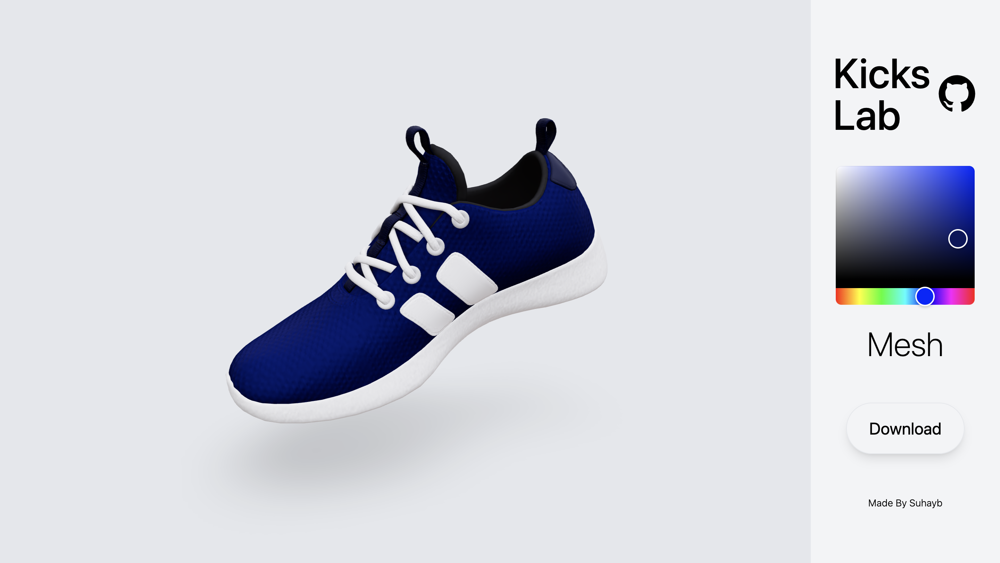

# Kicks Lab

A 3D Shoe Configurator\
Made Using React Three Fiber, ThreeJS, Valtios, TailwindCSS

## Screenshots:

### References:
[YouTube - Yuri Artiukh](https://youtu.be/xy_tbV4pC54?si=exkTSvEjtrsDwA_P)\
[Reference Code](https://codesandbox.io/p/sandbox/shoe-configurator-qxjoj?)\
[React Three Fiber Docs](https://docs.pmnd.rs/react-three-fiber/getting-started/examples)\
[ThreeJS Docs](https://threejs.org/docs/)\
[ThreeJS Forum](https://discourse.threejs.org/)

